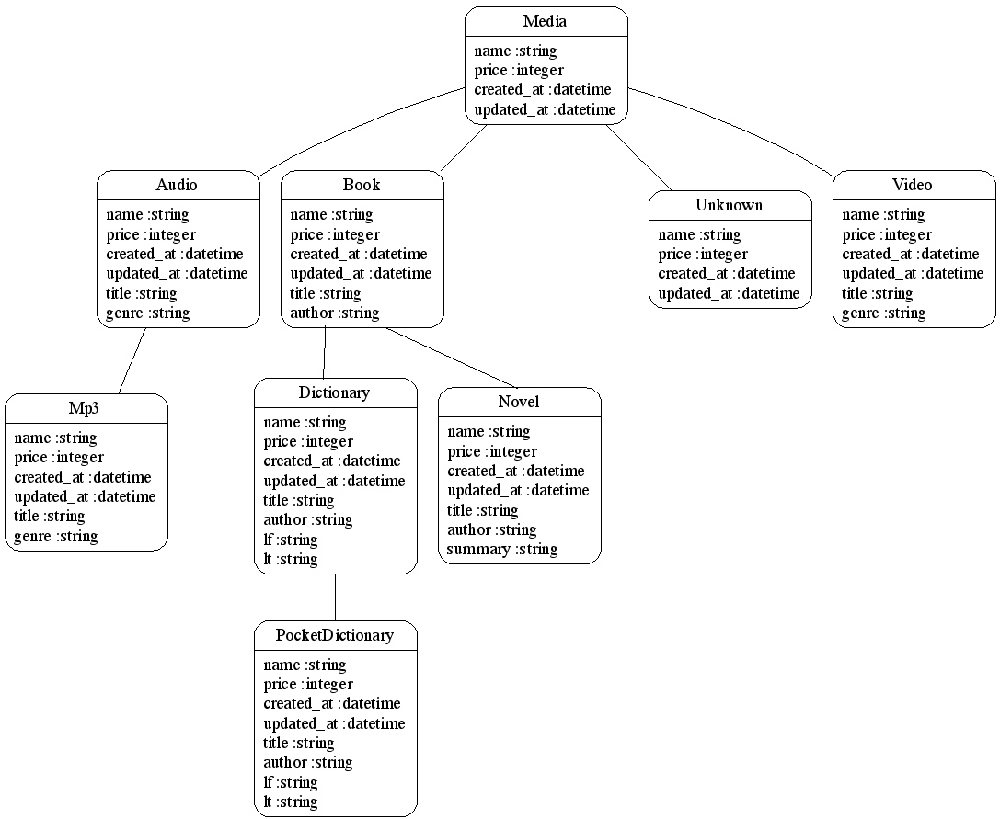

Problem Statement
=================
Imagine writing a multimedia library app with different types of media (for example : Audio, Mp3, Video, Book, Novel, Dictionary, Pocket_Dictionary, and Unknown media).

Normally all media would have common attributes such as *name* and *price*

Some attributes will likely differ :

- Audio medias may have a title and a genre,
- Mp3 medias may have a title and a genre,
- Video medias could have a title and a genre,
- Book medias may have an author and a title,
- Dictionary medias may have an author, a title, and two languages language1 and language2.
- Novel medias may have an author, a title, and a summary.
- Pocket_Dictionary medias may have an author, a title, and two languages language1 and language2

You can easily infer that Audio is a Media, MP3 is an Audio Media, Video is a Media, Unknown is a Media, Book is a Media, Dictionary is a Book, Novel is a Book and Pocket Dictionary is a Dictionary. When this type of relationship is being programmed, we generally use inheritance. If we consider that they should be stored into a database, this would look like:


class Media < ActiveRecord::Base
end

class Audio < Media
end

class Mp3 < Audio
end

class Video < Media
end

class Book < Media
end

class Novel < Book
end

class Dictionary < Book
end

class PocketDictionary < Dictionary
end

class Unknown < Media
end
